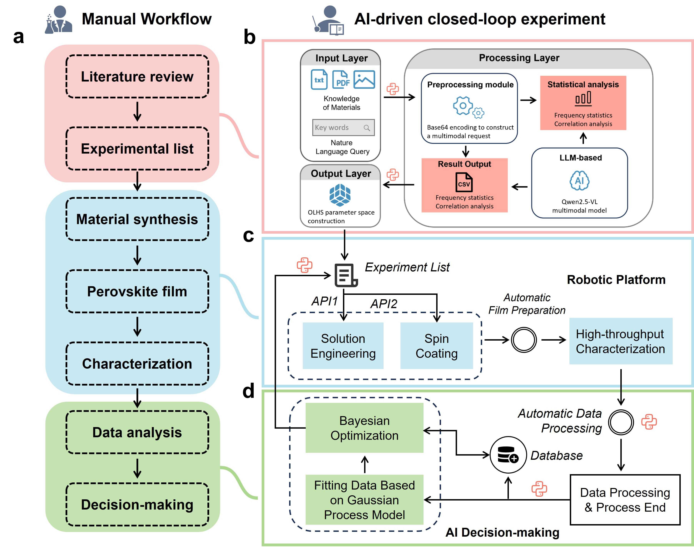
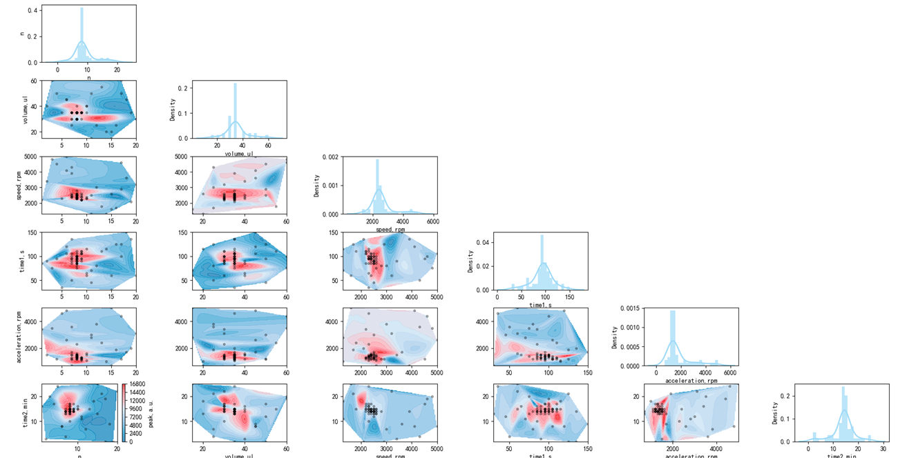
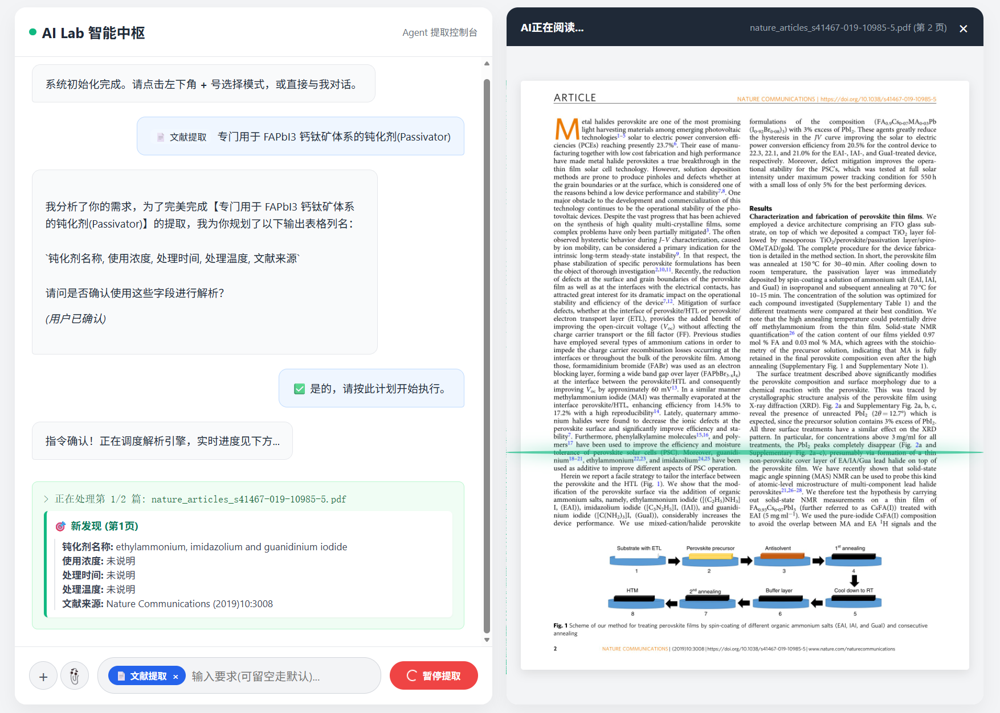

# Closed-Loop Experimental Intelligence for Autonomous Materials Discovery and Optimization


Xujie Hui<sup>1</sup>, Wei Meng<sup>1</sup>, Kaixiang Lai<sup>1</sup>, Zhipeng Huang<sup>1</sup>, Feiyue Lu<sup>1</sup>, Jiahao Li<sup>1</sup>, Hongyu Zhang<sup>1</sup>,Ziwen Mo<sup>1</sup>  Jingyan Qi<sup>1</sup>, Ying Shang<sup>1</sup>, Zhipeng Yin<sup>1</sup>, Zhangyu Yuan<sup>1</sup>, Jialin Wu<sup>1</sup>, Ning Li<sup>1</sup>, <sup>2*</sup>


# Content

This repository contains the code used to implement the machine learning workflow described in the main manuscript and illustrated in Fig. 1.

All of the code is run on Python 3.10

<p align="center"></p>


# Full Repository Structure

```
AI-driven-closed-loop/
├── figure                    	# The fold for Figures
├── README.md                   # Core documentation for the repository
├── guass_and_bayesian-optimization/  # Gaussian Process & Bayesian Optimization module
│   ├── data/			        # The data was fed back from expriment
│   ├── newProcesses/          	# New process suggested by Bayesian Optimization
│   ├── BO_function.py          # Core implementation of Bayesian Optimization
│   ├── data_processing.py      # Experimental data processing (cleaning, transformation, normalization)
│   ├── get_features.py         # Feature extraction from experimental data
│   ├── guass_function.py       # Gaussian Process-related functions (modeling, prediction)
│   ├── main.py                 # Entry script for the Bayesian Optimization module
│   └── requirements.txt        # Dependency list for the Bayesian Optimization module
└── LLM/                        # Large Language Model (LLM) related module
    ├── APP/                    # Application layer (core business logic)
    │   ├── app.py              # Flask main service
    │   └── reagent_layout.json # Reagent configuration file (physical positions in BPxx format)
    ├── Agent_client/           # Hardware controller
    │   └── agent_client.py     # MQTT communication client (command distribution, hardware interaction)
    │	└── tools.py			# Hardware available for invocation
    ├── extract/                # Archive for historical results (timestamped experimental outputs)
    ├── requirements.txt        # Dependency list for the LLM module
    └── templates/              # Frontend page templates
        └── index.html          # Frontend UI (multi-mode interaction, PDF preview, progress visualization)
```


# Core Workflow

1. User interacts with the frontend (`index.html`) and sends massages to LLM by api (`app.py`);

2. `app.py` calls the LLM to extract the target parameters that user gave in step 1;

3. Extract results are saved to `extract/` and fed back to `app.py` to invocate `tool.py` to run experiments;

4. `tool.py` converts vague instructions into precise low-level motor commands for `agent_client.py`;

5. `agent_client.py` sends commands to lab hardware via MQTT to run experiments;

6. Experimental results are saved to `guass_and_bayesian-optimization/data` and fed back to the Bayesian optimization module for iterative improvement.

7. The Bayesian optimization algorithm can suggest the experimental parameters for the next round, which is saved to `guass_and_bayesian-optimization/newprocess`;

8. The new process can be run by `agent_client.py` if the user commands;

9. The system forms a fully closed **experiment-analysis-optimization-reexperiment** loop.

   

# Environment Setup

###  1. Create Virtual Environment

```bash
conda create -n SDL_agent python=3.10 -y
conda activate SDL_agent
```

###  2. Install Dependencies

```bash
pip install -r requirements.txt
```

###  3. Key Configuration Items 

Modify the following configurations in app.py to adapt to the local environment:

```bash
# LLM API Configuration
SILICONFLOW_API_KEY = "your SiliconFlow API key"
MODEL_NAME = "Qwen/Qwen2.5-VL-72B-Instruct"
API_URL = "https://api.siliconflow.cn/v1/chat/completions"

# PDF storage directory
PDF_FOLDER = r"PDF_Fold"

# MQTT server configuration (Agent_client/tool.py)
class Client_Conf:
    def __init__(self):
        self.client_id = "your_custom_client_id"
        self.usr_name = "your_mqtt_username"
        self.password = "your_mqtt_password"
        self.ip = "your_mqtt_server_ip"
        self.port = 1883
```

# Quick Start

1. Configure **API key, PDF directory, and MQTT server settings**.

2. Start the Flask server:

   ```bash
   python app.py
   ```

3. Wait a second and browser will open for you.

   

# Results

## BO Part

<p align="center"></p>

newest publish in [laikaixiang/guass_and_bayesian-optimization](https://github.com/laikaixiang/guass_and_bayesian-optimization)

## LLM Part

<p align="center"></p>

<p align="center"></p>

<p align="center"></p>

newest publish in [laikaixiang/SDL_agent: an agent design for self driving labs](https://github.com/laikaixiang/SDL_agent) and [Raymondm0/AutonomousPlatform](https://github.com/Raymondm0/AutonomousPlatform)


# Contributing

Contributions to AI-driven-closed-loop are welcome! The following individuals are currently involved in the project:

Kaixiang Lai

Zhipeng Huang 

Ziwen Mo

Xujie Hui
